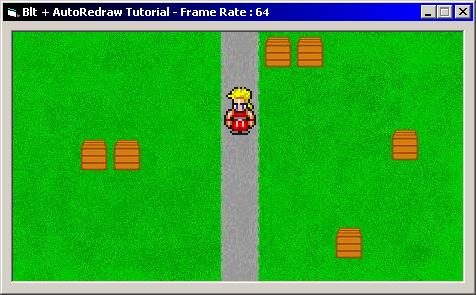



## BitBlt\+AutoRedraw Tutorial \- FAST & EASY\. Animate Sprites, collision detection, transparency\!

### Description

This is a medium sized tutorial on the basics of making games without DirectX, and still get the great frame rates. Best of all, it is very easy. This tutorial has most of the things you will need; Sprite Animation; Transparency; Collision Detection; Position Tracking; and the basics of transferring images to the Main Frame. It also explains what the options in the Declare "BitBlt" are, and how to use them. And also, almost every line is commented! Please vote, and enjoy. I spent two hours on this for everyone of you (including myself, I was getting rusty).
 
### More Info
 

             |
---                |---
**Submitted On**   |2002-12-06 15:34:42
**By**             |[SOLID4K TEAM](https://github.com/Planet-Source-Code/PSCIndex/blob/master/ByAuthor/solid4k-team.md)
**Level**          |Intermediate
**User Rating**    |4.8 (24 globes from 5 users)
**Compatibility**  |VB 5\.0, VB 6\.0
**Category**       |[Games](https://github.com/Planet-Source-Code/PSCIndex/blob/master/ByCategory/games__1-38.md)
**World**          |[Visual Basic](https://github.com/Planet-Source-Code/PSCIndex/blob/master/ByWorld/visual-basic.md)
**Archive File**   |[BitBlt\+Aut1509021262002\.zip](https://github.com/Planet-Source-Code/solid4k-team-bitblt-autoredraw-tutorial-fast-easy-animate-sprites-collision-detection-tran__1-41360/archive/master.zip)

